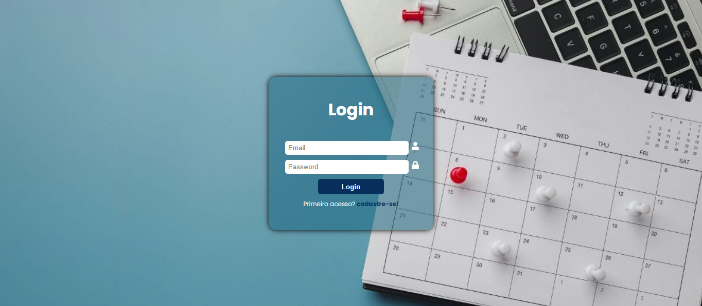

Nome ferramenta: Celeste secretaria virtual.
Objetivo: A proposta é entregar uma ferramenta de agendamentos, automona e de fácil usabilidade.

Este website esta sendo construído com as tecnolgias:

- Vite
- React
- HTML e CSS
- JavaScript
- LocalStorage

 
Dois ambientes:

- Profissional: Stackholder que será responsavel por cadastrar suas disponibilidades de atendimento;
- Usuário: Neste ambiente o usuário vai poder consultar os dias disponíveis, escolher o que corresponde com sua necessidade.

A Celeste trata de comunicar o profissional, sobre o agendamento e inativar a disponibilidade recem agendada.

<h3 align="center">Em construção</h3>
